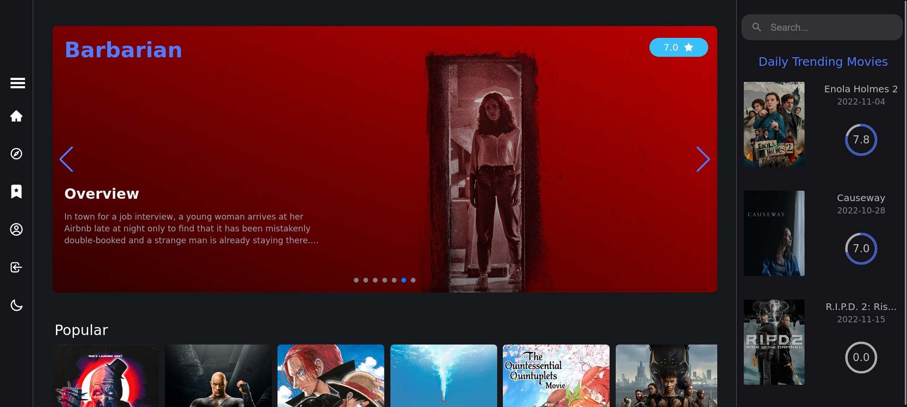
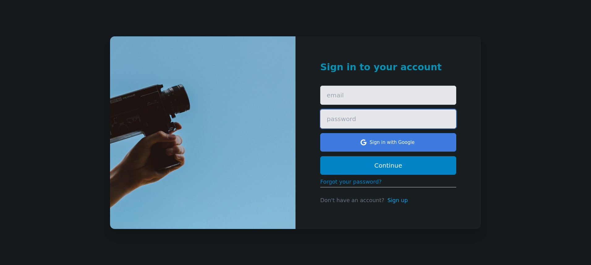
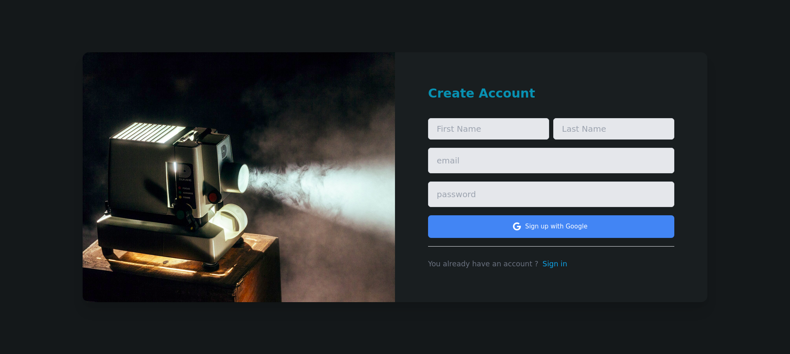
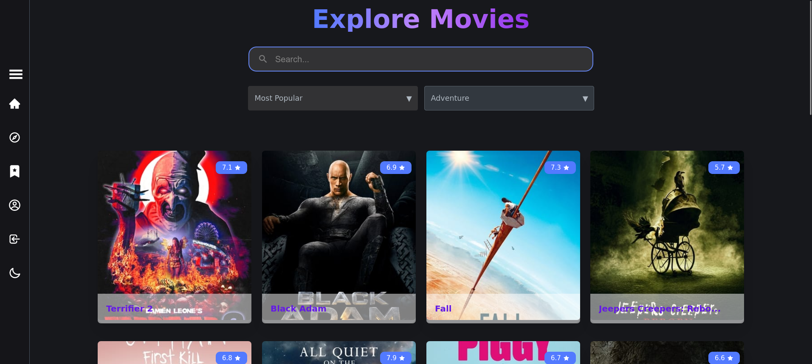
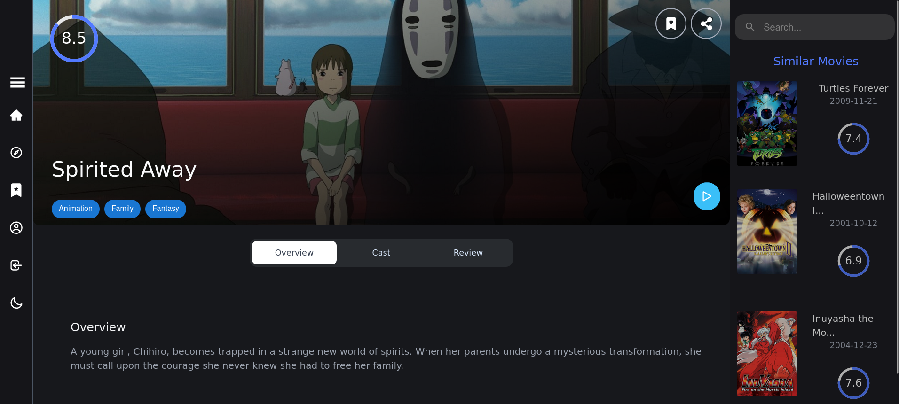
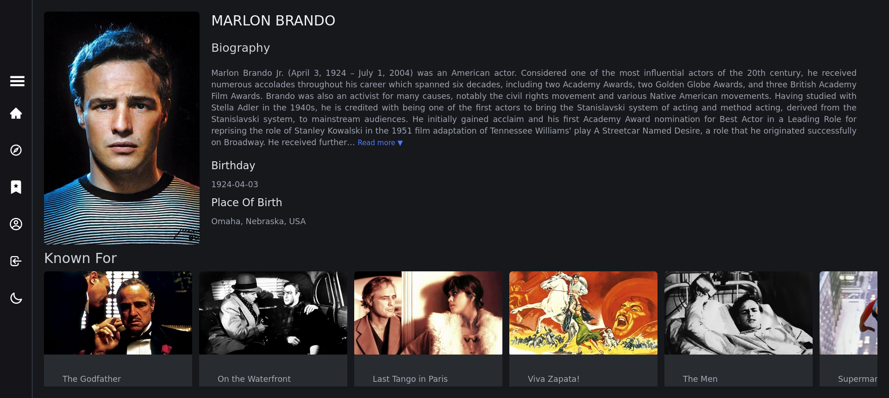

<div align="center">

  <h1>Magic Lantern Movie Web Application</h1>

<p>
  <a href="https://github.com/doandroidsdreamof/react-movie-app/graphs/contributors">
    
  </a>
  <a href="">
    
  </a>
  <a href="https://github.com/doandroidsdreamof/react-movie-app/network/members">
    
  </a>
  <a href="https://github.com/doandroidsdreamof/react-movie-app/stargazers">
    
  </a>
  <a href="https://github.com/doandroidsdreamof/react-movie-app/issues/">
    
  </a>
</p>

<h4>
    <a href="https://comfy-seahorse-2583c7.netlify.app/">View Demo</a>
  <span> · </span>
    <a href="https://github.com/react-movie-app/react-movie-app/issues">Report Bug</a>
  <span> · </span>
    <a href="https://github.com/react-movie-app/react-movie-app/issues">Request Feature</a>
  </h4>
</div>

<br />

# :notebook_with_decorative_cover: Table of Contents

- [Screenshots](#camera-screenshots)
- [Tech Stack](#space_invader-tech-stack)
- [Features](#dart-features)

* [Getting Started](#toolbox-getting-started)
  - [Prerequisites](#bangbang-prerequisites)
  - [Installation](#gear-installation)
  - [Run Locally](#running-run-locally)
* [Roadmap](#compass-roadmap)
* [Contributing](#wave-contributing)
* [Contact](#handshake-contact)
* [Acknowledgements](#gem-acknowledgements)

<!-- Screenshots -->

### :camera: Screenshots

<div align="center">
  
</div>
<div align="center">
  
</div>
<div align="center">
  
</div>
<div align="center">
  
</div>
<div align="center">
  
</div
<div align="center">
  
</div

<!-- TechStack -->

### :space_invader: Tech Stack

<details>
  <summary>Client</summary>
  <ul>
    <li>React</li>
    <li>TailwindCSS</li>
    <li>daisyUI</li>
    <li>Material UI</li>
  </ul>
</details>

<details>
  <summary>Server</summary>
  <ul>
    <li>Firebase</li>
  </ul>
</details>

<details>
<summary>Database</summary>
  <ul>
    <li>Firestore</li>
  </ul>
</details>

<details>
<summary>DevOps</summary>
  <ul>
    <li>Github</li>
    <li>Git</li>
  </ul>
</details>

### :dart: Features

- Authentication
- Comment Functionality
- Bookmark Functionality
- Autocomplete Functionality
- Search Functionality
- Sort Functionality
- Reusable Components
- Infinite Scroll
- Lazy Loading
- Video Player

## :toolbox: Getting Started

<!-- Prerequisites -->

### Prerequisites

This project uses Npm as package manager

```bash
npm install -g npm
```

<!-- Running Tests -->

### :running: Run Locally

Clone the project

```bash
  git clone https://github.com/doandroidsdreamof/react-movie-app.git

```

Go to the project directory

```bash
  cd react-movie-app
```

Install dependencies

```bash
  npm install
```

Start the server

```bash
  npm run dev
```

## :compass: Roadmap

- [x] Comment Functionality
- [x] Bookmark Functionality
- [x] Social Media Share
- [x] Profile Settings
- [x] Form Validation
- [x] Authentication
- [x] Reauthentication
- [x] Alert Messages
- [ ] Tests
- [ ] PWA Functionality
- [x] Notification
- [x] Dark Mode
- [ ] Logo
- [ ] optimization
- [ ] Dashboard && Authorization

<!-- Contributing -->

## :wave: Contributing

<a href="https://github.com/Louis3797/awesome-readme-template/graphs/contributors">
</a>

Contributions are always welcome

## :gem: Acknowledgements

- [Shields.io](https://shields.io/)
- [Awesome README](https://github.com/matiassingers/awesome-readme)
- [Emoji Cheat Sheet](https://github.com/ikatyang/emoji-cheat-sheet/blob/master/README.md#travel--places)
- [Readme Template](https://github.com/othneildrew/Best-README-Template)
